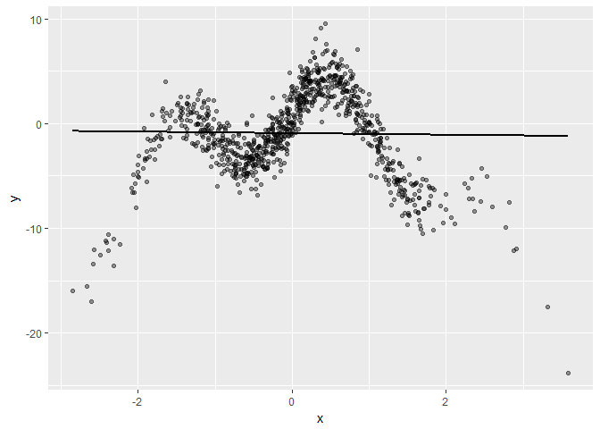
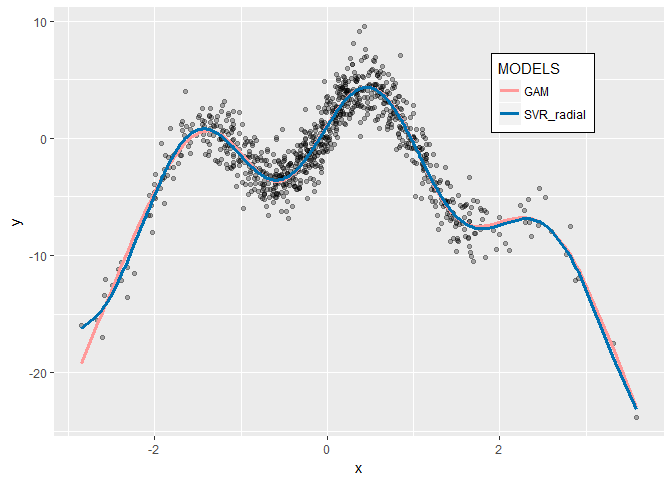

Non-Linear Regression
================

[Solving NonLinear Problems with R](https://github.com/MNoorFawi/nonlinear-regression)
----------------------------------

linear regression is such a great method to predict a variable measurement based on other variables. but not always the relationship between the variables in hand are linear. sometimes the relationship is nonlinear so linear methods won't be the perfect solution. in these problems shine other algorithms such as the ones we're going to talk about here; **Generalized Additive Models (GAM)** and **Support Vector Regression (SVR)**

Support Vector Regression is just subtle modification to the Support Vector Machines models to use it in scoring problems not only in classification problems.

GAM model in its simplest form, tries to relax the linearity constraint and finds a set of functions s\_i() and a constant term a0 such that f(x\[i,\]) = a0 + s\_1(x\[i,1\]) + s\_2(x\[i,2\]) + ... s\_n(x\[i,n\])

Let's look at an example; we first synthesize the data.

``` r
library(ggplot2)
set.seed(13)
x <- rnorm(1000)
noise <- rnorm(1000, sd = 1.5)
y <- 4 * sin(3 * x) + cos(0.8 * x) - 1.5 * (x ^ 2 ) + noise
select <- runif(1000)
d <- data.frame(x = x, y = y)
training <- d[select > 0.1, ]
test <-d[select <= 0.1, ]

ggplot(training, aes(x = x, y = y)) + geom_point(alpha = 0.4) +
  geom_smooth(se = FALSE, method = 'lm', col = 'black')
```



``` r
linear_model <- lm(y ~ x, data = training)
resid_linear <- training$y - predict(linear_model)
## RMSE
sqrt(mean(resid_linear ^ 2))
```

    ## [1] 4.025166

as we can see the relationship between x and y are totally nonlinear and as in the data defining also has noise. so linear regression isn't performing so well in this caseas it's clear in the chart and also from the high RMSE it gives

let's look at our two other methods.

### Fitting a GAM model.

``` r
library(mgcv)
gam_model <- gam(y ~ s(x), data = training)
gam_model$converged
```

    ## [1] TRUE

``` r
resid_gam <- training$y - predict(gam_model)
## RMSE
sqrt(mean(resid_gam ^ 2))
```

    ## [1] 1.478665

the RMSE score is so improved. let's now look at the other way.

### Support Vector regression

first we need to tune a model to get the best parameters to use.

``` r
library(e1071)
tuned <- tune.svm(y ~ x, training, kernel = 'radial',
                  gamma = c(seq(0.1, 1, 0.1), 10^(-6:-1)),
                  cost = 10^(-3:1))
tuned
```

    ## 
    ## Parameter tuning of 'svm':
    ## 
    ## - sampling method: 10-fold cross validation 
    ## 
    ## - best parameters:
    ##  gamma cost
    ##    0.5   10
    ## 
    ## - best performance: 2.232384

cost = 10 and gamma = 0.5. these are the best parameters to use with a radial svm kernel in this data.

``` r
svr_model <- svm(y ~ x, data = training, kernel = 'radial',
                 cost = 10, gamma = 0.5)
resid_svr <- training$y - predict(svr_model)
sqrt(mean(resid_svr ^ 2))
```

    ## [1] 1.465271

almost the same RMSE score as the one the GAM model has given us.

##### let's compare the two models on the test data and see how they may perform on data they haven't seen yet.

``` r
## test residuals
test_resid_svr <- test$y - predict(svr_model, test)
test_resid_gam <- test$y - predict(gam_model, test)
## test RMSE
sqrt(mean(test_resid_svr ^ 2))
```

    ## [1] 1.62327

``` r
sqrt(mean(test_resid_gam ^ 2))
```

    ## [1] 1.62861

``` r
## R Squared
cor(test$y, predict(gam_model, test)) ^ 2
```

    ## [1] 0.8277811

``` r
cor(test$y, predict(svr_model, test)) ^ 2
```

    ## [1] 0.8299968

very great results !!!

now let's visualize how well they fit the data

``` r
training$svr_pred <- predict(svr_model, training)
training$gam_pred <- predict(gam_model, training)
ggplot(training, aes(x = x, y = y)) + 
  geom_point(alpha = 0.3) + 
  geom_line(aes(y = gam_pred, 
            color = 'GAM'), size = 1.3) +
  geom_line(aes(y = svr_pred, 
            color = 'SVR_radial'), size = 1.3) +
  scale_colour_manual(
    name="MODELS", 
    values=c(GAM = "#FF9999", SVR_radial = "#0072B2")) +
  theme(legend.position = c(0.8, 0.8)) +
  theme(legend.background=element_rect(fill="white", colour="black"))
```



now we have two models that almost give exactly the same results which are fantastic in predicting y based on nonlinear x both on training and test data so they can be generalized with confidence.
